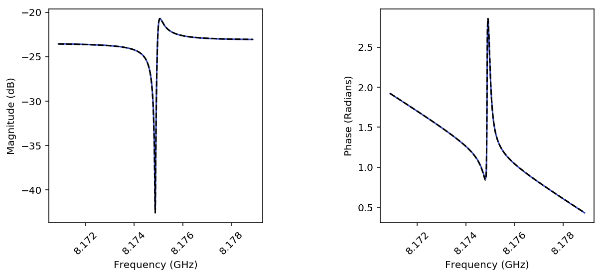
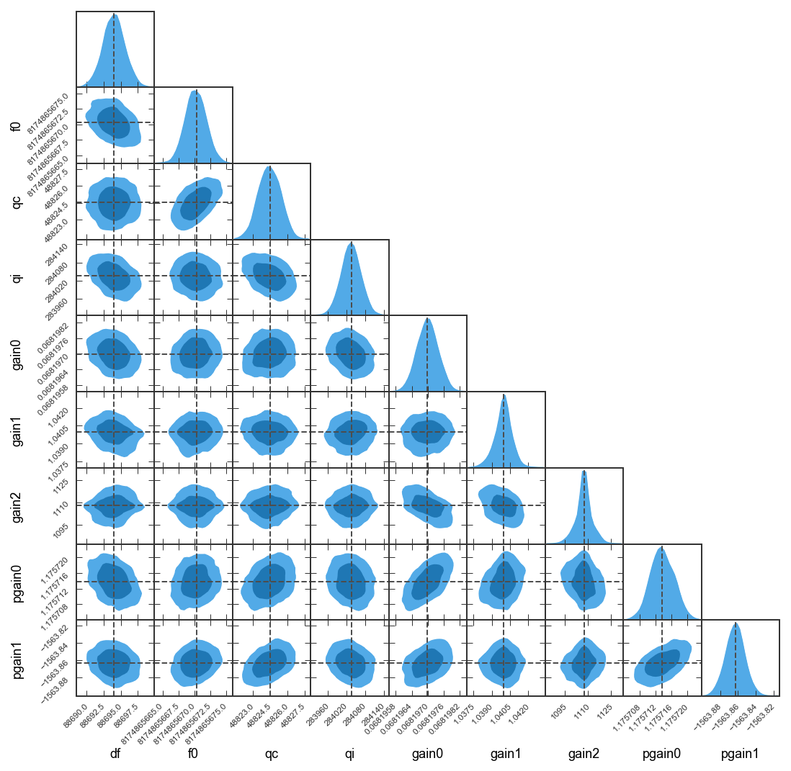

Example 1: Load one file into the ``Resonator`` class
=====================================================

**By: Faustin Carter, 2016, updated 2018**

This notebook imports the data from one Agilent file, creates a
``Resonator`` object, runs a fitting routine, and then plots the data
and fit curves in a nice way.

Once you've understood this example, you should be able to replicate it
with your own data simply be writing a custom ``process_file`` function
and updating the code that finds the datafile.

.. code:: ipython3

    #Set up the notebook for inline plotting
    %matplotlib inline
    
    #For high-res figures. You can comment this out if you don't have a retina screen
    %config InlineBackend.figure_format = 'retina' 
    
    #For pretty printing of dicts
    import pprint as pp
    
    #Because you should always import numpy!
    import numpy as np

Load up the ``scraps`` modules
------------------------------

You'll need to change the path to reflect wherever you stored the code

.. code:: ipython3

    import os
    
    #Add the scraps folder to the path. You can skip this if you pip installed it.
    import sys
    sys.path.append(os.getcwd()+'scraps/')
    
    #Load up the resonator code!
    import scraps as scr

Load a file and process the data
--------------------------------

This unpacks the file data into a dict objects. This block of code is
the only thing you need to change to make this work with your data.

The data dict has the following quantities:

-  **I, Q, and freq**: numpy arrays of data from the VNA file

-  **name**: an arbitrary string describing the resonator. This is
   description of the physical object. So if you run two sweeps on the
   same resonator at different powers or temperatures, you should give
   them the same name.

-  **pwr, temp**: floats that describe the power in dB and the
   temperature in K that the measurement was taken at.

.. code:: ipython3

    #Load in a file
    dataFile = './ExampleData/RES-1_-10_DBM_TEMP_0.113.S2P'
    
    #Use the process_file routine to read the file and create a dict of resonator data
    fileDataDict = scr.process_file(dataFile, skiprows=1)
    
    #Look at the contents of the dict:
    pp.pprint(fileDataDict)

.. parsed-literal::

    {'I': array([-0.022739, -0.022687, -0.02265 , ...,  0.063827,  0.063836,
            0.063869]),
     'Q': array([ 0.062457,  0.062449,  0.062447, ...,  0.02939 ,  0.029329,  0.02928 ]),
     'freq': array([  8.17088000e+09,   8.17088400e+09,   8.17088800e+09, ...,
             8.17887200e+09,   8.17887600e+09,   8.17888000e+09]),
     'name': 'RES-1',
     'pwr': -10.0,
     'temp': 0.113}

Make a ``Resonator`` object
---------------------------

You can either create a resonator object directly, or use the
``makeResFromData`` helper tool, which takes the data dict you made
earlier as an argument. The ``makeResFromData`` tool also allows you to
simultaneously fit the data to a model, by passing the model along.

``makeResFromData`` returns a resonator object, as well as the
temperature rounded to the nearest 5 mK and the power. This is for
convenience when dealing with large numbers of ``Resonator`` objects
programmatically.

The ``Resonator`` object takes the I, Q, and freq data and calculates
magnitude and phase.

The ``cmplxIQ_params`` function sets up a ``lmfit`` ``Parameters``
object which can later be passed to a fitting function. It also tries to
guess the baseline of the magnitude and the electrical delay (i.e.
baseline) of the phase, as well as starting values for frequency and
quality factor. The ``cmplxIQ_fit`` function is model function that uses
the parameters defined in ``cmplxIQ_params`` that is passed to the
``do_lmfit`` or ``do_emcee`` methods of the ``Resonator`` object.

.. code:: ipython3

    #Create a resonator object using the helper tool
    resObj1 = scr.makeResFromData(fileDataDict)
    
    #Create a resonator object using the helper tool and also fit the data
    #To do this, we pass a function that initializes the parameters for the fit, and also the fit function
    resObj2 = scr.makeResFromData(fileDataDict, paramsFn = scr.cmplxIQ_params, fitFn = scr.cmplxIQ_fit)
    
    #Check the temperature and power
    print('Temperature = ', resObj1.temp)
    print('Power = ', resObj1.pwr)
    
    #Check to see whether a results object exists
    print('Do fit results exist for the first object? ', resObj1.hasFit)
    print('Do fit results exist for the second object? ', resObj2.hasFit)
    
    
    #Explicitly call the fitter on the first object.
    #Here we will call it, and also override the guess for coupling Q with our own quess
    resObj1.load_params(scr.cmplxIQ_params)
    resObj1.do_lmfit(scr.cmplxIQ_fit, qc=5000)
    
    #Check to see whether a results object exists again, now they are both True
    print('Do fit results exist for the first object? ', resObj1.hasFit)
    print('Do fit results exist for the second object? ', resObj2.hasFit)
    
    #Compare the best guess for the resonant frequency (minimum of the curve) to the actual fit
    #Because we didn't specify a label for our fit, the results are stored in the lmfit_result
    #dict under the 'default' key. If we passed the optional label argument to the do_lmfit
    #method, it would store the results under whatever string is assigned to label.
    print('Guess = ', resObj2.fmin, ' Hz')
    print('Best fit = ', resObj2.lmfit_result['default']['result'].params['f0'].value, ' Hz')
    print('Best fit with different qc guess = ',
          resObj1.lmfit_result['default']['result'].params['f0'].value, ' Hz')
    
    #You can see the fit is not terribly sensitive to the guess for qc.

.. parsed-literal::

    Temperature =  0.113
    Power =  -10.0
    Do fit results exist for the first object?  False
    Do fit results exist for the second object?  True
    Do fit results exist for the first object?  True
    Do fit results exist for the second object?  True
    Guess =  8174865993.0  Hz
    Best fit =  8174865670.34  Hz
    Best fit with different qc guess =  8174865670.34  Hz

Make a pretty plot
------------------

Fits aren't worth anything if you don't plot the results!!

.. code:: ipython3

    #When using inline plotting, you have to assign the output of the plotting functions to a figure, or it will plot twice
    
    #This function takes a list of resonators. It can handle a single one, just need to pass it as a list:
    figA = scr.plotResListData([resObj1],
                              plot_types = ['LogMag', 'Phase'], #Make two plots
                              num_cols = 2, #Number of columns
                              fig_size = 4, #Size in inches of each subplot
                              show_colorbar = False, #Don't need a colorbar with just one trace
                              force_square = True, #If you love square plots, this is for you!
                              plot_fits = [True]*2) #Overlay the best fit, need to specify for each of the plot_types

Find the maximum liklhood estimate of the fit params using ``emcee``
--------------------------------------------------------------------

Let's use the built-in ``emcee`` hooks to compare the results of the
``lmfit`` values with the maximum liklihood values for the fit
parameters.

.. code:: ipython3

    #Call the emcee hook and pass it the fit function that calculates your residual.
    #Since we already ran a fit, emcee will use that fit for its starting guesses.
    resObj2.do_emcee(scr.cmplxIQ_fit, nwalkers = 30, steps = 1000, burn=200)

.. code:: ipython3

    #Check to see that a emcee result exists
    print('Does an emcee chain exist? ', resObj2.hasChain)
    
    #Look at the first few rows of the output chain:
    chains = resObj2.emcee_result['default']['result'].flatchain
    
    print('\nHead of chains:')
    pp.pprint(chains.head())
    
    #Compare withe the mle values (percent difference):
    #Maximum liklihood estimates (MLE) are stored in Resonator.mle_vals
    #lmfit best fit values for varied parameters are in Resonator.lmfit_vals
    diffs = list(zip(resObj2.mle_labels, (resObj2.mle_vals - resObj2.lmfit_vals)*100/resObj2.lmfit_vals))
    
    print('\nPerecent difference:')
    pp.pprint(diffs)

.. parsed-literal::

    Does an emcee chain exist?  True
    
    Head of chains:
                 df            f0            qc             qi     gain0  \
    0  88694.637513  8.174866e+09  48825.968684  284032.418900  0.068196   
    1  88694.633409  8.174866e+09  48825.922210  284032.532886  0.068196   
    2  88694.633409  8.174866e+09  48825.922210  284032.532886  0.068196   
    3  88693.936736  8.174866e+09  48825.168106  284030.256892  0.068197   
    4  88694.084139  8.174866e+09  48825.026661  284031.759541  0.068197   
    
          gain1        gain2    pgain0       pgain1  
    0  1.040011  1107.766240  1.175713 -1563.868140  
    1  1.040013  1107.764981  1.175712 -1563.868598  
    2  1.040013  1107.764981  1.175712 -1563.868598  
    3  1.040044  1107.745343  1.175714 -1563.867138  
    4  1.040052  1107.749879  1.175713 -1563.868613  
    
    Perecent difference:
    [('df', 0.00016457041577626805),
     ('f0', 4.9636793175466591e-09),
     ('qc', -7.1412453256857882e-05),
     ('qi', 0.00066200624835167574),
     ('gain0', -0.00018165545757985608),
     ('gain1', -0.0091685488964723463),
     ('gain2', 0.0047494130464930022),
     ('pgain0', -8.9449361862636539e-05),
     ('pgain1', 0.00025065766561930896)]

Make a sweet giant triangle confusogram of your ``emcee`` results.
------------------------------------------------------------------

If you don't have ``pygtc`` installed, open a terminal and type
``pip install pygtc``. Go ahead, I'll wait...

.. code:: ipython3

    import pygtc

.. code:: ipython3

    #Plot the triangle plot, and overlay the best fit values with dashed black lines (default)
    #You can see that the least-squares fitter did a very nice job of getting the values right
    
    #You can also see that there is some strange non-gaussian parameter space that the MCMC
    #analysis maps out! This is kind of wierd, but not too worrisome. It is probably suggestive
    #that more care is needed in choosing good options for the MCMC engine.
    
    figGTC = pygtc.plotGTC(chains, truths = [resObj2.lmfit_vals])

Notice how the 2D histograms for ``gain 1`` and ``gain 2`` look like
sideways cats eyes? This is probably because the MCMC analsysis hasn't
quite converged, or maybe there could be outliers. We can plot the
actual chains to see for ourselves.

.. code:: ipython3

    #We will need to directly use matplotlib for this
    import matplotlib.pyplot as plt
    
    #First, let's make a copy of the chains array so we don't mess up the raw data
    mcmc_result = resObj2.emcee_result['default']['result'].chain.copy()
    
    #And we can plot the chains to see what is going on
    for ix, key in enumerate(resObj2.emcee_result['default']['mle_labels']):
        plt.figure()
        plt.title(key)
        for cx, chain in enumerate(mcmc_result[:,:,ix]):
            plt.plot(chain)

.. image:: _static/Example1_LoadAndPlot_files/Example1_LoadAndPlot_17_4.png
   :width: 412px
   :height: 263px

It looks like we need to burn off some samples from the beginning of
each chain so that we are only operating on data that has converged. We
can use a built in method to do this. From looking at the chains for
``gain 1`` and ``gain 2`` it looks like 400 samples should be about
right.

.. code:: ipython3

    #Do the burn
    resObj2.burn_flatchain(400)
    
    #This will add a new flatchain object, which we can use to plot a new corner plot
    pygtc.plotGTC(resObj2.emcee_result['default']['flatchain_burn']);

.. parsed-literal::

    /Users/fcarter/anaconda/envs/py36/lib/python3.6/site-packages/pandas/core/dtypes/dtypes.py:150: FutureWarning: elementwise comparison failed; returning scalar instead, but in the future will perform elementwise comparison
      if string == 'category':

The cat-eye shape is gone now. It looks like there is a little
bi-modality in the ``df`` and ``f0`` histograms, but exploring that can
be an exercise for the reader!

