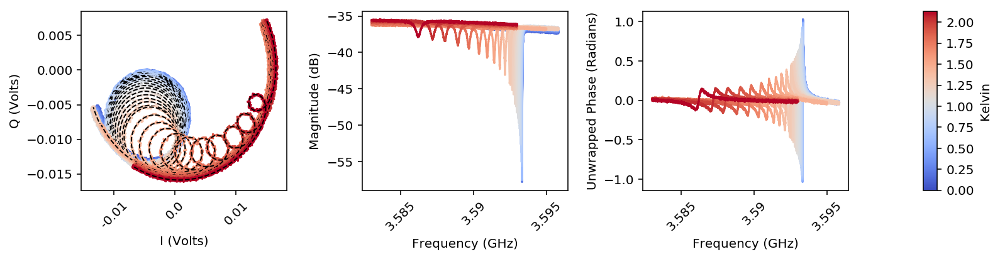
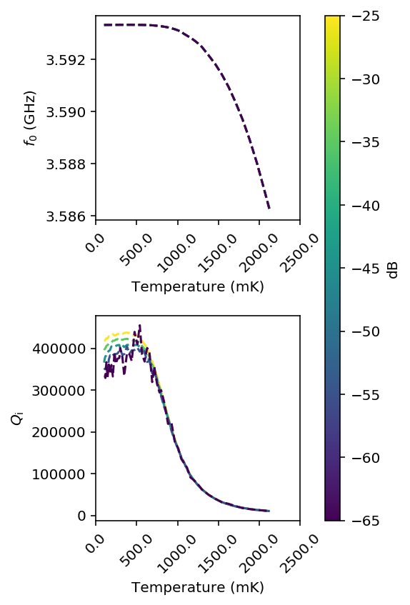
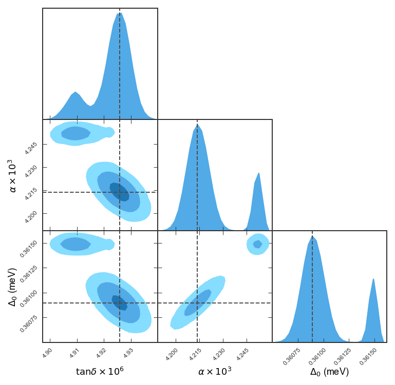
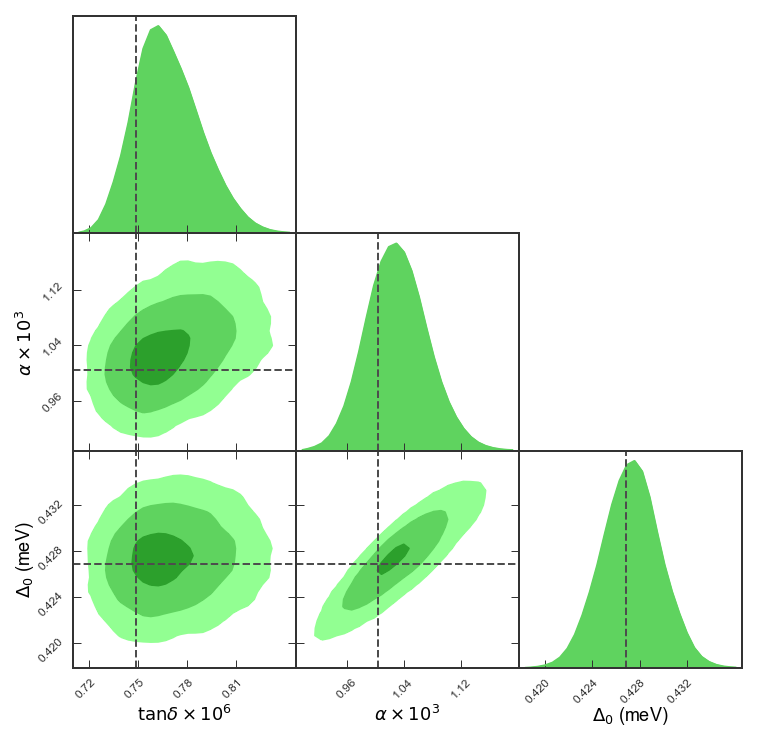

=================================================================
Figure generation for a manuscript (using NbN CPW resonator data)
=================================================================

This file is autogenerated from the example JuPyter notebook in the git repo.

**by: Faustin W. Carter, 2016**

Data is from a niobium-nitride CPW resonator fabricated at ANL by Trupti
Khaire. It was installed in a copper box, and wirebonded with gold bonds
to an impdence matching board that translated the signal from coax to
CPW. It is worth noting that the "power" listed in the data is the power
at the VNA output in dBm. The signal passes through about 60-70 dB of
attenuation on its way down to the resonator, and then experiences
between 40-50 dB amplification on the way back up. In other words, the
power axis is very much uncalibrated.

Import some stuff
=================

.. code:: python

    #Plot options for inline-notebook figures
    %matplotlib inline

    #this is for retina screens like a MacBook pro
    %config InlineBackend.figure_format = 'retina'

    #Useful for saving resonator fit data
    import datetime
    import cPickle

    #This is optional, comment out if
    #you don't care about covariance plots.
    import pygtc

    #import the resonator analysis software
    import scraps as scr

    #Define some resonator names
    resNames = ['RES-1', 'RES-2', 'RES-3']

Load the data using the makeResList tool from ``scraps``
========================================================

*If you have cached data, skip a few cells down to "Load up previously cached data"*
====================================================================================

The output is going to be a ``dict``, keyword-indexed by the strings in
resNames

.. code:: python

    #Define the path to the data directory
    dataPath = './08222016Res/'

    #Make a dict of lists of resonators, one for each name
    resLists = {}
    for resName in resNames:
        resLists[resName] = scr.makeResList(scr.process_file,
                                            dataPath,
                                            resName)

Now run fits on the resonator objects

.. code:: python

    #Loop through the dict, and then through each list and
    #run lmfit on each S21 transmission data trace
    for resName in resNames:
        for res in resLists[resName]:
            if res.pwr < -60:
                #Apply a filter to the data before
                #guessing parameters for low-power measuremnts
                res.load_params(scr.cmplxIQ_params,
                                use_filter=True)
            else:
                res.load_params(scr.cmplxIQ_params,
                                use_filter=False)

            res.do_lmfit(scr.cmplxIQ_fit)
            #You can uncomment this line to run the
            #MCMC sampler on each resonator.
            #This will probably take several hours.
    #         res.do_emcee(scr.cmplxIQ_fit,
    #                      nwalkers = 30,
    #                      steps = 1000,
    #                      burn=200)

Cache fit results for future analysis
=====================================

Once you have run all the fits (which can take 5 or 10 minutes) it is a
good idea to cache that data. To do that, run the next cell down. Then,
the next time you come back, instead of reloading and refitting all the
data, you can just load the cached object back into memory.

.. code:: python

    #Save resLists to a pickle file for easy loading later.
    #This is useful for caching data after you have run fits
    #that take a long time.
    fName = 'CPW6_' + datetime.datetime.strftime(datetime.datetime.now(),
                                                 '%Y%m%d_%H_%M')
    f = open('./'+fName+'.pickle', 'wb')
    cPickle.dump(resListsAu, f, 2)
    f.close()
    print 'last saved file was: '+fName+'.pickle'

Load up previously cached data
==============================

If you have a .pickle file from a previous run, you can load it up with
this cell, and skip everything above except for the first cell that
imports modules.

.. code:: python

    #Load resLists from a pickle file
    fName = './saved_data.pickle'
    f = open(fName, 'rb')
    resLists = cPickle.load(f)
    f.close()

Now we can make a plot of the traces.
=====================================

.. code:: python

    fig1a = scr.plotResListData(resLists['RES-1'],
                                plot_types=['IQ', 'LogMag', 'uPhase'],
                                detrend_phase = True,
                                plot_fits = [True, False, False],
                                color_by='temps',
                                num_cols = 3,
                                fig_size=3,
                                powers = [-55])

    #Uncomment to save the figure
    #fig1a.savefig('fig1a.pdf')

Use the MCMC sampler to calculate covariances for one of the fits
=================================================================

Running this next cell will take a few minutes (5 or 10, maybe)

.. code:: python

    #Get the index of the resonator at the hottest temperature and
    #the lowest power
    t_max = max([res.temp for res in resLists['RES-1'] if res.pwr == -65])

    #rix just stands for resonator index
    rix = scr.indexResList(resLists['RES-1'], t_max, -65)

    #Run the MCMC sampler and use the best-fit values from the
    #least-squares routine as starting positions
    #The first 300 samples from each chain are
    #discarded to allow for burn-in
    resLists['RES-1'][rix].do_emcee(scr.cmplxIQ_fit,
                                    nwalkers = 100,
                                    steps = 1000,
                                    burn=300)

Use ``pygtc`` to plot the parameter covariances
===============================================

From here on out, you'll need the ``pygtc`` package, or a similar
package like ``corner`` to view the covariances.

.. code:: python

    #Make a copy of the MCMC chain so that we
    #can modify the units before plotting
    mcmc_chain = resLists['RES-1'][rix].chain.copy()

    #Change the frequency units from Hz to GHz
    mcmc_chain.T.iloc[1]/=1e9

    #pygtc will automatically get labels from
    #parameter names, but it is nicer to define them
    #because we can use LaTex to make them pretty
    labels = ['$\delta f (Hz)$',
                '$f_0 (GHz)$',
                '$Q_\mathrm{c}$',
                '$Q_\mathrm{i}$',
                '$g_0 (W)$',
                '$g_1 (W)$',
                '$g_2 (W)$',
                '$\phi_0$',
                '$\phi_1$']

    #Copy the best-fit values from the least-squares
    #routine so we can modify the units
    least_squares_fit_vals = resLists['RES-1'][rix].lmfit_vals.copy()

    #Change the frequency units from Hz to GHz
    least_squares_fit_vals[1]/=1e9

    #Call pygtc to make the figure
    fig1b = pygtc.plotGTC(mcmc_chain,
                           truths=least_squares_fit_vals,
                           paramNames=labels,
                           GaussianConfLevels=True,
                           nConfidenceLevels=3,
                           figureSize=8)

    #Uncomment to save the figure
    #fig1b.savefig('fig1b.pdf')

S21 fit results vs temperature and power
========================================

Now, in order to look at the fit parameters as a function of power
and/or temperature, we first have to load all the fit parameters into a
custom dict of ``pandas`` DataFrames called a ``ResonatorSweep`` object.

.. code:: python

    #Define a dict that will hold all the ResonatorSweep objects
    #(one for each name).

    #Each of these objects will be a dict of pandas DataFrames

    resSweeps = {}
    for resName, resList in resLists.iteritems():
        resSweeps[resName] = scr.ResonatorSweep(resList, index='block')

    #Look at the uncertainties on the best-fit frequencie
    #for the first few files of 'RES-1'
    resSweeps['RES-1']['f0_sigma'].head()

.. raw:: html

    

    <table border="1" class="dataframe">
      <thead>
        <tr style="text-align: right;">
          <th></th>
          <th>-75.0</th>
          <th>-65.0</th>
          <th>-55.0</th>
          <th>-45.0</th>
          <th>-35.0</th>
          <th>-25.0</th>
        </tr>
      </thead>
      <tbody>
        <tr>
          <th>101.0</th>
          <td>2.342925e+04</td>
          <td>241.628635</td>
          <td>80.353994</td>
          <td>26.967362</td>
          <td>13.266917</td>
          <td>8.362478</td>
        </tr>
        <tr>
          <th>108.0</th>
          <td>1.155629e+12</td>
          <td>253.306191</td>
          <td>80.905558</td>
          <td>27.029800</td>
          <td>12.093033</td>
          <td>9.255624</td>
        </tr>
        <tr>
          <th>118.0</th>
          <td>6.169252e+06</td>
          <td>245.307879</td>
          <td>82.002065</td>
          <td>27.355258</td>
          <td>11.756653</td>
          <td>10.169799</td>
        </tr>
        <tr>
          <th>129.0</th>
          <td>1.013165e+08</td>
          <td>243.320043</td>
          <td>82.249325</td>
          <td>26.863802</td>
          <td>12.327247</td>
          <td>8.720828</td>
        </tr>
        <tr>
          <th>143.0</th>
          <td>1.020450e+08</td>
          <td>248.635163</td>
          <td>82.393823</td>
          <td>27.061348</td>
          <td>11.951223</td>
          <td>9.116620</td>
        </tr>
      </tbody>
    </table>
    

Now we can look at the fit parameters from the previous step vs Temperature or Power
====================================================================================

.. code:: python

    fig1c = scr.plotResSweepParamsVsTemp(resSweeps['RES-1'],
                                        fig_size = 3,
                                        plot_keys = ['f0', 'qi'],
                                        plot_labels = ['$f_0$ (GHz)',
                                                       '$Q_\mathrm{i}$'],
                                        unit_multipliers = [1e-9, 1],
                                        num_cols = 1,
                                        powers = [-25, -35, -45, -55, -65],
                                        force_square=True)
    #Uncomment to save the figure
    #fig1c.savefig('fig1c.pdf')

Fitting secondary fit parameters to a model
===========================================

Now we will fit the frequency as a function of temperature and power to
a model and use the MCMC sampler to calculate the parameter covariances
for that fit.

Generate model parameters
-------------------------

Since ``scraps`` doesn't have any models for secondary parameter fitting
built in (except for a very simple toy model, which we will use) we need
to specify some parameters and starting guesses.

.. code:: python

    import lmfit as lf

    f0_params = lf.Parameters()

    #Resonant frequency at zero temperature and zero power
    f0_guess = resSweeps['RES-1']['f0'].iloc[0, 0]
    f0_params.add('f0',
                  value = f0_guess,
                  min = f0_guess*0.95,
                  max = f0_guess*1.05)

    #The loss roughly equivalent to tan delta
    f0_params.add('Fd',
                  value = 1e-6,
                  min = 1e-8)

    #The kinetic inductance fraction
    f0_params.add('alpha',
                  value = 0.005,
                  min = 0,
                  max = 1)

    #The BCS energy gap at zero temperature
    f0_params.add('delta0',
                  value = 5e-4,
                  min = 1e-5,
                  max = 1e-3,)

    #Qi needs all of the above parameters, plus a few more
    qi_params = f0_params.copy()

    #Q at zero power and zero temperature
    qi_params.add('q0',
                  value = 4e5,
                  min = 1e4,
                  max = 1e6)

    #Critical power in W (modulo some calibration)
    qi_params.add('Pc',
                  value = 4,
                  min = 0,
                  max = 1)

    #Set the max temperature to fit to
    max_fit_temp = 800

Run the fit with the toy model
==============================

Here we are using the toy model included in
``scraps.fitsSweep.f0_tlsAndMBT``. It is definitely not physically valid
(except for maybe aluminum), and low weight should be placed on the
value of the fit parameters generated. However, it captures the overall
character of the data, and so it is useful as an example.

First we run an individual fit on two of the surfaces: ``f0`` and
``qi``.

.. code:: python

    resSweeps['RES-1'].do_lmfit(['qi'],
                                [scr.fitsSweep.qi_tlsAndMBT], #The model
                                [qi_params], #The paramters
                                min_pwr=-70, #S21 fits below -70 were bad
                                max_temp=max_fit_temp)

    resSweeps['RES-1'].do_lmfit(['f0'],
                                [scr.fitsSweep.f0_tlsAndMBT], #The model
                                [f0_params], #The paramters
                                min_pwr=-70, #S21 fits below -70 were bad
                                max_temp=max_fit_temp)

    #Uncomment to look at the results of the fit
    #lf.report_fit(resSweeps['RES-1'].lmfit_results['qi'])

Plot the results as a surface
=============================

We use the 3D plotting functionality to look at the fit (black-dashed
mesh) overplotted on the semi-transparent surface that is the data.

.. code:: python

    fig2a = scr.plotResSweep3D(resSweeps['RES-1'],
                               plot_keys=['f0'],
                               max_temp=775,
                               unit_multipliers=[1e-9],
                               plot_labels = ['$f_0$ (GHz)'],
                               min_pwr=-70,
                               fig_size=5,
                               plot_lmfits=True)

    fig2b = scr.plotResSweep3D(resSweeps['RES-1'],
                               plot_keys=['qi'],
                               max_temp=775,
                               unit_multipliers=[1e-6],
                               plot_labels = ['$Q_\mathrm{i}\\times10^{-6}$'],
                               min_pwr=-70,
                               fig_size=5,
                               plot_lmfits=True)

    #When the tick labels are really long, it's nice to push them out a little
    #So they don't overlap with the label. This will be automatically handled
    #in the next version.
    fig2a.axes[0].tick_params(axis='z', pad=8)
    fig2a.axes[0].zaxis.labelpad = 13

    #Save figures
    #fig2a.savefig('fig2a.pdf')
    #fig2b.savefig('fig2b.pdf')

Use MCMC to look at the fit parameter covariances
=================================================

Running this next cell will take a few minutes.

.. code:: python

    resSweeps['RES-1'].do_emcee(['f0'],
                                [scr.fitsSweep.f0_tlsAndMBT],
                                min_pwr=-70,
                                max_temp=max_fit_temp,
                                emcee_kwargs = {'nwalkers':100,
                                                'steps':1000,
                                                'burn':300})

    resSweeps['RES-1'].do_emcee(['qi'],
                                [scr.fitsSweep.qi_tlsAndMBT],
                                min_pwr=-70,
                                max_temp=max_fit_temp,
                                emcee_kwargs = {'nwalkers':100,
                                                'steps':1000,
                                                'burn':300})

Use ``pygtc`` to plot the parameter covariances
===============================================

As before, we'll use ``pygtc`` to look at the parameter covariances. The
black dashed lines are the best-fit values from the least-squares
routine. It is nice to scale the numerical values before plotting, so as
before, we will do that.

.. code:: python

    #Get the resulting MCMC chain for the 'f0' fit
    f0_mcmc_chain = resSweeps['RES-1'].emcee_results['f0'].flatchain.copy()

    #Grab the best-fit values from the least-squares run
    f0_lmfit_truths = [val for key, val in
        resSweeps['RES-1'].lmfit_results['f0'].params.valuesdict().iteritems()]

    #Scale the parameters for nicer viewing
    mults = [1e9, 1e-6, 1e-3, 1e-3]

    for ix, m in enumerate(mults):
        f0_mcmc_chain.T.iloc[ix]/=m
        f0_lmfit_truths[ix]/=m

    #Make some nicer labels than just the parameter keys
    f0_labels = ['$f_0 (GHz)$',
                 '$\\tan \delta\\times10^{6}$',
                 '$\\alpha\\times10^{3}$',
                 '$\Delta_0$ (meV)']

    #Call pygtc to plot the figure
    fig2c = pygtc.plotGTC(f0_mcmc_chain.iloc[:,1:],
                            truths = f0_lmfit_truths[1:],
                            paramNames=f0_labels[1:],
                            GaussianConfLevels=True,
                            nConfidenceLevels=3,
                            figureSize=6)

    #Save figure
    #fig2c.savefig('fig2c.pdf')

    #Get the resulting MCMC chain for the 'qi' fit
    qi_mcmc_chain = resSweeps['RES-1'].emcee_results['qi'].flatchain.copy()

    #Grab the best-fit values from the least-squares run
    qi_lmfit_truths = [val for key, val in
        resSweeps['RES-1'].lmfit_results['qi'].params.valuesdict().iteritems()]

    #Scale the parameters for nicer viewing
    mults = [1e9, 1e-6, 1e-3, 1e-3, 1e6, 1e-6]

    for ix, m in enumerate(mults):
        qi_mcmc_chain.T.iloc[ix]/=m
        qi_lmfit_truths[ix]/=m

    #Make some nicer labels than just the parameter keys
    qi_labels = ['$f_0 (GHz)$',
                 '$\\tan \delta\\times10^{6}$',
                 '$\\alpha\\times10^{3}$',
                 '$\Delta_0$ (meV)',
                '$Q_\mathrm{i}(0)\\times10^{-6}$',
                '$P_\mathrm{c}$ ($\mu$W)']

    #Call pygtc to plot the figure
    fig2d = pygtc.plotGTC(qi_mcmc_chain.iloc[:,1:4],
                            truths = qi_lmfit_truths[1:4],
                            paramNames=qi_labels[1:4],
                            GaussianConfLevels=True,
                            nConfidenceLevels=3,
                            figureSize=6,
                            colorsOrder = 'greens')

    #Save figure
    #fig2d.savefig('fig2d.pdf')

Joint fit of ``f0`` and ``qi``
==============================

It is possible to run a joint fit also. However, this will likely not
add very much information given that the shared parameters disagree by
amounts much larger than their variance between the two fits. In any
case, here is a joint fit demonstrated for completeness.

.. code:: python

    #Run the joint fit using the least-squares engine
    resSweeps['RES-1'].do_lmfit(['f0', 'qi'],
                                [scr.fitsSweep.f0_tlsAndMBT, scr.fitsSweep.qi_tlsAndMBT], #The model
                                [f0_params, qi_params], #The paramters
                                min_pwr=-70, #S21 fits below -70 were bad
                                max_temp=max_fit_temp)

Now calculate the parameter covariances with MCMC.

.. code:: python

    resSweeps['RES-1'].do_emcee(['f0', 'qi'],
                                [scr.fitsSweep.f0_tlsAndMBT, scr.fitsSweep.qi_tlsAndMBT],
                                min_pwr=-70,
                                max_temp=max_fit_temp,
                                emcee_kwargs = {'nwalkers':100,
                                                'steps':1000,
                                                'burn':300})

And look at the result with ``pygtc``. It's pretty clear that the 'qi'
part of the fit is dominating the results for whatever reason. Probably
this has to do with not scaling the uncertainties correctly or
something.

.. code:: python

    #Get the resulting MCMC chain for the 'qi' fit
    f0qi_mcmc_chain = resSweeps['RES-1'].emcee_joint_results['f0+qi'].flatchain.copy()

    #Scale the parameters for nicer viewing
    mults = [1e9, 1e-6, 1e-3, 1e-3, 1e6, 1e-6]

    for ix, m in enumerate(mults):
        f0qi_mcmc_chain.T.iloc[ix]/=m
        f0qi_lmfit_truths[ix]/=m

    #Make some nicer labels than just the parameter keys
    f0qi_labels = ['$f_0 (GHz)$',
                 '$\\tan \delta\\times10^{6}$',
                 '$\\alpha\\times10^{3}$',
                 '$\Delta_0$ (meV)',
                '$Q_\mathrm{i}(0)\\times10^{-6}$',
                '$P_\mathrm{c}$ ($\mu$W)']

    #Call pygtc to plot the figure
    fig2d = pygtc.plotGTC(f0qi_mcmc_chain,
                            paramNames=f0qi_labels,
                            GaussianConfLevels=True,
                            nConfidenceLevels=3,
                            figureSize=6)

